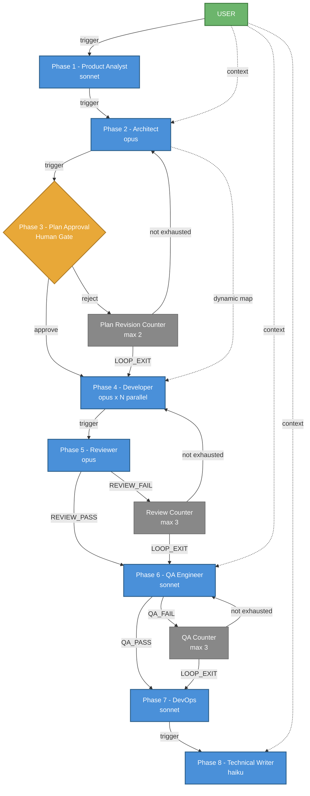
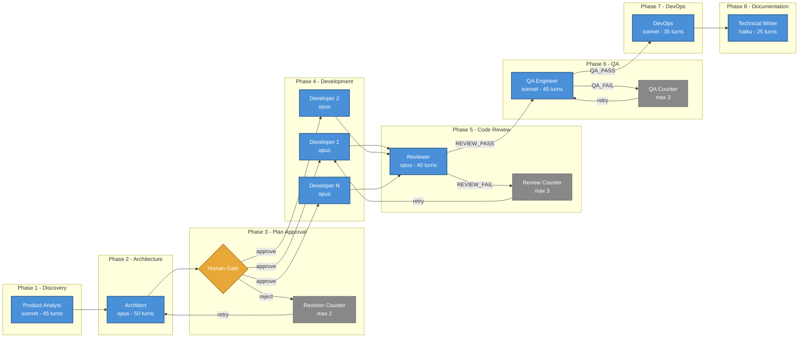

# Agile Dev Workflow — Akış Dokumantasyonu

## Genel Bakış

| Bilgi | Deger |
|-------|-------|
| Dosya | `yaml_instance/agile_dev.yaml` |
| Agent Sayısı | 7 (Product Analyst, Architect, Developer, Reviewer, QA Engineer, DevOps, Technical Writer) |
| Toplam Node | 12 (7 agent + 3 loop counter + 1 human gate + 1 passthrough) |
| Toplam Edge | 21 (15 trigger + 6 context) |
| SCC (Döngü) | 3 bağımsız döngü |
| Paralel Katman | 8 faz sıralı |

---

## Akış Diyagramı



Detayli versiyon - fazlar gruplu:



---

## Faz Faz Detaylı Akış

### Phase 1: Discovery — Product Analyst

```
USER prompt gelir
  │
  ▼
Product Analyst (claude-code/sonnet)
  ├── Kullanıcı isteğini analiz eder
  ├── Exa Search ile pazar araştırması yapar
  ├── Gereksinim listesi (FR-1, FR-2...) oluşturur
  ├── UX spesifikasyonu yazar (ekranlar, akışlar, durumlar)
  └── Çıktı → Architect'e gider
```

### Phase 2: Architecture — Architect

```
Product Analyst çıktısı + USER prompt (context) gelir
  │
  ▼
Architect (claude-code/opus)
  ├── Sistem mimarisi tasarlar (ADR'ler, tech stack)
  ├── Context7/DeepWiki ile framework doğrulaması yapar
  ├── DB şeması tasarlar (tablolar, indeksler, FK'ler)
  ├── Güvenlik modeli oluşturur (STRIDE, OWASP)
  ├── API kontratları tanımlar
  ├── "### Task N:" formatında iş planı oluşturur
  └── Çıktı → Plan Approval'a gider
                + context edge ile task'lar Developer'a iletilir (dynamic map)
```

### Phase 3: Plan Approval — Human Gate

```
Architect'in tasarım dokümanı gösterilir
  │
  ▼
Kullanıcı karar verir:
  ├── "approve" / "onay" / "tamam" → Developer başlar
  └── Başka bir şey yazarsa (revizyon isteği) → Plan Revision Counter
        │
        ▼
      Counter kontrol eder:
        ├── < 2 iterasyon → Architect'e geri gider (feedback ile)
        └── = 2 iterasyon → LOOP_EXIT → Developer başlar (mevcut planla devam)
```

### Phase 4: Development — Developer (Paralel)

```
Architect'in task planı dynamic map ile split edilir:
  "### Task 1: ..." → Developer Instance 1
  "### Task 2: ..." → Developer Instance 2
  "### Task 3: ..." → Developer Instance 3
  ...                  (max 5 paralel)
  │
  ▼
Her Developer instance (claude-code/opus):
  ├── Sadece kendi task'ındaki dosyaları oluşturur/düzenler
  ├── Context7 ile API doğrulaması yapar
  ├── Backend → Business Logic → API → Frontend → Test sırasıyla ilerler
  ├── Unit test'leri yazar
  └── Tüm instance'lar tamamlanınca → Reviewer'a gider
```

**Dynamic Map Nasıl Çalışır:**
Architect'in çıktısındaki `### Task N:` pattern'i regex ile yakalanır. Her match ayrı bir Developer instance'ına gönderilir. Bu instance'lar paralel çalışır (max 5). Tümü bitince tek bir birleşik çıktı Reviewer'a iletilir.

### Phase 5: Code Review — Reviewer

```
Developer çıktısı gelir (clear_context: önceki mesajlar temizlenir)
  │
  ▼
Reviewer (claude-code/opus)
  ├── Tüm kaynak kodunu okur
  ├── SOLID prensipleri kontrol eder
  ├── OWASP Top 10 güvenlik taraması yapar
  ├── Bulguları P1/P2/P3 olarak sınıflandırır
  └── Karar verir:
        ├── REVIEW_PASS → QA Engineer'a gider
        └── REVIEW_FAIL → Review Counter
              │
              ▼
            Counter kontrol eder:
              ├── < 3 iterasyon → Developer'a geri gider (fix listesiyle)
              └── = 3 iterasyon → LOOP_EXIT → QA Engineer'a gider
```

### Phase 6: QA — QA Engineer

```
Developer'ın kodu gelir + USER prompt (context)
  │
  ▼
QA Engineer (claude-code/sonnet)
  ├── FR-N gereksinimlerini test eder
  ├── API endpoint'lerini doğrular
  ├── Otomatik test suite'i yazar
  ├── Bug bulursa KENDİSİ düzeltir (SDET rolü)
  ├── Fix'i doğrular
  └── Karar verir:
        ├── QA_PASS → DevOps'a gider
        └── QA_FAIL → QA Counter
              │
              ▼
            Counter kontrol eder:
              ├── < 3 iterasyon → QA Engineer'a geri döner (tekrar fix dener)
              └── = 3 iterasyon → LOOP_EXIT → DevOps'a gider
```

### Phase 7: DevOps

```
Çalışan + test edilmiş kod gelir
  │
  ▼
DevOps (claude-code/sonnet)
  ├── Dockerfile oluşturur (multi-stage build)
  ├── docker-compose.yml yazar
  ├── CI/CD pipeline kurar (.github/workflows/)
  ├── Health check endpoint'leri ekler
  ├── Runbook yazar
  └── Çıktı → Technical Writer'a gider
```

### Phase 8: Documentation — Technical Writer

```
Tüm proje dosyaları + USER prompt (context) gelir
  │
  ▼
Technical Writer (claude-code/haiku)
  ├── README.md oluşturur
  ├── API dokümantasyonu yazar
  ├── CHANGELOG.md oluşturur
  ├── Gereksinim izlenebilirlik matrisi hazırlar
  └── Delivery raporu sunar
        │
        ▼
      WORKFLOW TAMAMLANDI
```

---

## Context Edge'leri (Bilgi Taşıma)

Context edge'leri `trigger: false` — hedef node'u tetiklemez, sadece bilgi taşır. Hedef node zaten tetiklendiğinde bu bilgiyi ek kontekst olarak alır.

| Kaynak | Hedef | Amaç |
|--------|-------|------|
| USER | Architect | Orijinal kullanıcı isteğini Architect'e de taşır (Product Analyst çıktısına ek olarak) |
| USER | QA Engineer | QA'nın gereksinimleri doğrudan görmesini sağlar |
| USER | Technical Writer | Dokümantasyonun kullanıcı isteğiyle tutarlı olmasını sağlar |
| Architect | Developer | **Dynamic Map**: Task planını regex ile split eder, her task'ı ayrı Developer instance'ına gönderir |

---

## Döngüler (SCC — Strongly Connected Components)

Workflow'da 3 bağımsız döngü var. Her biri bir loop counter ile sınırlandırılmış:

```
SCC #1: Plan Revision Döngüsü
┌─────────────────────────────────────────────┐
│  Architect ←→ Plan Approval ←→ Plan Counter │
│  Max: 2 iterasyon                           │
│  Çıkış: approve veya LOOP_EXIT             │
└─────────────────────────────────────────────┘

SCC #2: Code Review Döngüsü
┌──────────────────────────────────────┐
│  Developer ←→ Reviewer ←→ Rev Counter│
│  Max: 3 iterasyon                    │
│  Çıkış: REVIEW_PASS veya LOOP_EXIT  │
└──────────────────────────────────────┘

SCC #3: QA Test Döngüsü
┌──────────────────────────────────────┐
│  QA Engineer ←→ QA Counter           │
│  Max: 3 iterasyon                    │
│  Çıkış: QA_PASS veya LOOP_EXIT      │
└──────────────────────────────────────┘
```

---

## Keyword Mekanizması

Edge'ler keyword condition'ları ile yönlendirilir:

| Edge | Koşul Türü | Keyword'ler | Anlamı |
|------|-----------|-------------|--------|
| Plan Approval → Developer | `any` | approve, onay, tamam | Bu kelimelerden biri varsa fire et |
| Plan Approval → Counter | `none` | approve, onay, tamam | Bu kelimelerden hiçbiri yoksa fire et |
| Reviewer → QA | `any` | REVIEW_PASS | REVIEW_PASS keyword'ü varsa fire et |
| Reviewer → Counter | `none` | REVIEW_PASS | REVIEW_PASS yoksa fire et (yani FAIL) |
| QA → DevOps | `any` | QA_PASS | QA_PASS keyword'ü varsa fire et |
| QA → Counter | `none` | QA_PASS | QA_PASS yoksa fire et (yani FAIL) |
| Counter → Loop back | `none` | LOOP_EXIT | Henüz tükenmemişse geri dön |
| Counter → Forward | `any` | LOOP_EXIT | Tükendiyse ileri git |

---

## Agent Modelleri ve Sıralaması

| Faz | Agent | Model | Max Turns | Neden Bu Model |
|-----|-------|-------|-----------|----------------|
| 1 | Product Analyst | sonnet | 45 | Araştırma + analiz — hız/maliyet dengesi |
| 2 | Architect | **opus** | 50 | En kritik karar noktası — mimari tasarım |
| 4 | Developer | **opus** | 50 | Kod yazma kalitesi önemli |
| 5 | Reviewer | **opus** | 40 | Güvenlik + kalite denetimi — gözden kaçırma riski |
| 6 | QA Engineer | sonnet | 45 | Test + bug fix — sonnet yeterli |
| 7 | DevOps | sonnet | 35 | Config dosyaları — sonnet yeterli |
| 8 | Technical Writer | **haiku** | 25 | Dokümantasyon — en ucuz model yeterli |
